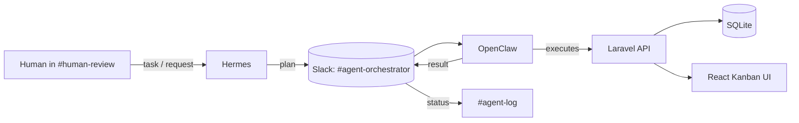

# Architecture

## Overview

This project pairs a conventional Laravel + React Kanban app with two AI agents that operate on it over Slack:

- **Hermes** — the planning/orchestration agent. Reads tasks, breaks them into steps, decides what needs to happen, and hands work off.
- **OpenClaw** — the execution agent. Takes Hermes's instructions and carries out the concrete action (code edits, API calls, board updates).

## Model Routing

| Agent | Role | Model | Why this model |
|---|---|---|---|
| Hermes | Planning, task decomposition, orchestration | `qwen3.5:9b` (local Ollama) with Gemini 2.5 Flash as a cloud fallback | Planning benefits from a model with stronger reasoning and longer context to hold the whole task plan; Qwen 3.5 9B was chosen for its larger context window and thinking-mode reasoning relative to the execution model. |
| OpenClaw | Executing discrete, well-specified actions | `ollama/gemma4:31b` via Ollama Cloud | Execution steps are narrower and more mechanical once Hermes has planned them, so a separate model tuned for agentic/coding tasks handles the "hands" work without needing to hold the full plan in context. |

Splitting planning and execution across two differently-sized/sourced models means each agent is doing the kind of work its model is best suited for, rather than one model doing both reasoning and execution — this is the "smart routing" referenced in the judging criteria.

Both agents are confirmed live: Hermes and OpenClaw each connected to Slack via socket mode and sent messages during the build (see `slack-export/` for evidence). The full plan → execute → API-call loop — where OpenClaw acts on Hermes's plan against the Laravel backend — is the next thing to verify end-to-end; this submission demonstrates the orchestration and messaging layer working, with API-level execution as a near-term follow-up.

## Communication Flow

1. A task is posted (by a human or by Hermes) in `#sprint-main`.
2. Hermes reads it, plans the steps, and posts the plan to `#agent-orchestrator`.
3. OpenClaw picks up the plan and attempts to execute it against the Laravel API.
4. Results and status updates are posted to `#agent-log`.
5. Anything needing a human decision is routed to `#human-review`.

## Backend

Laravel + SQLite, exposing a REST API for boards, lists, and cards (see `backend/routes/api.php`). Controllers and models mirror standard Kanban entities with `Board hasMany Lists`, `List hasMany Cards` relationships.

## Frontend

React (Vite) app rendering boards/lists/cards, talking to the Laravel API over HTTP.

## Known Limitations

- OpenClaw is confirmed connected and sending messages in Slack; a full autonomous task execution against the Laravel API has not yet been demonstrated end-to-end in this build window (see `agent-log.md`).
- Gemini 2.5 Flash quota was exhausted during development, so Hermes fell back to the local `qwen3.5:9b` model.
